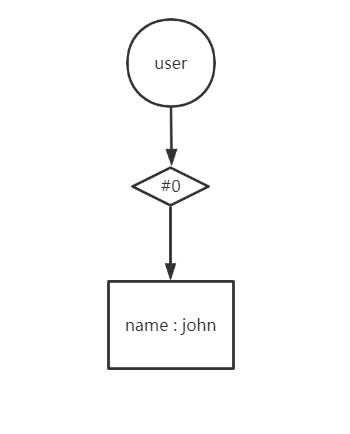
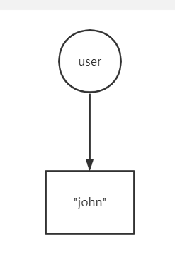
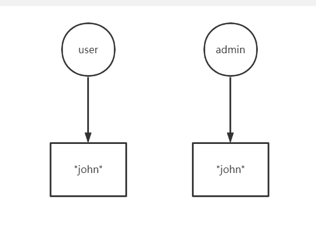
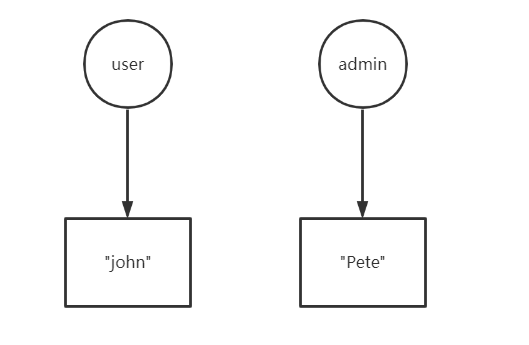
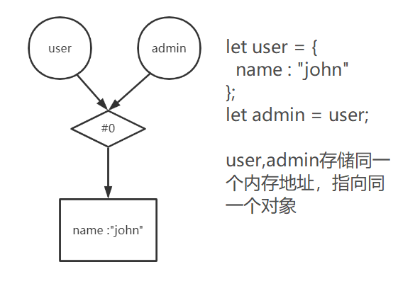
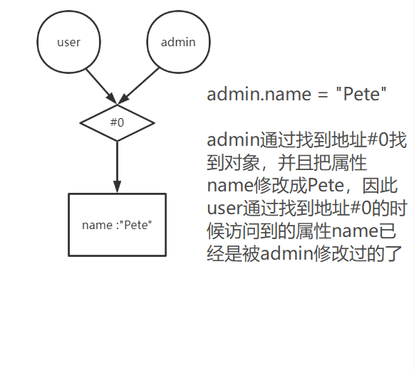

# JavaScript学习笔记（ES6）

感谢：[现代 JavaScript 教程](https://zh.javascript.info/)，本笔记只记录我所思考的，语法、方法等细节直接参考教程


## Object（对象）

在 JavaScript 中有 8 种基本的数据类型（译注：7 种原始类型和 1 种引用类型）。

1. Number类型：用于任何类型的数字：整数或浮点数，在 `±(253-1)` 范围内的整数。
2. BigInt类型：用于任意长度的整数。
3. String类型：用于字符串。一个字符串可以包含 0 个或多个字符，所以没有单独的单字符类型。
4. Boolean类型（true or false）
5. null（一个代表“无”、“空”或“值未知”的特殊值）
6. undefined（未被赋值）
7. symbol：用于唯一的标识符。
8. object（对象）：用于更复杂的数据结构。我认为在JavaScript就是个存储键值对的数据结构。

对象就是引用类型，引用类型存储的是对象在内存中的地址（可以理解成指针，但是它和指针不完全一样），形如"**let user = {name : "John"}**",对象是指" {...} "，对象的引用是指 " user "，" user "存储对象在内存中的地址，该地址指向内存中对应的对象，用图片来理解就是：



原始类型和引用类型的不同之处就是原始类型存储的是值，直接指向它的本体，例如" **let user =  "John"** "用图片来理解就是：



正因如此，赋值操作就出现很大的差别，例如字符串赋值操作：

```javascript
"use strict"

let user = "john";
let admin = user;

console.log(user);//输出 john
console.log(admin);//输出 john

admin = "Pete";

console.log(user);//输出 john
console.log(admin);//输出 Pete
```

用图片解释：

1. 
2. 

可以看出它们互不影响，这就是原始类型的赋值操作。

接下来看看引用类型的赋值操作是怎么样的：

```javascript
"use strict"

let user = {
  name : "john"
};
let admin = user;

console.log(admin === user);//输出 true，证明它们都指向同一个对象

console.log(user.name);//输出 john
console.log(admin.name);//输出 john

admin.name = "Pete";

console.log(user.name);//输出 Pete
console.log(admin.name);//输出 Pete
```

用图片解释：

1. 

2. 

   引用类型可以比喻成我和小豪去游泳馆游泳，我们需要把衣服背包等东西存放起来，我们就要去管理员处申请一个存储柜，我去申请存储柜这一行为相当于我要创建一个对象了，管理员这时给我一把钥匙，相当于我存储了一个对象的引用，该引用指向那个存储柜——对象。存储柜内的衣服背包等于对象内的各种属性。" **let admin = user;** "这个操作就相当于我去配钥匙的地方，把这个开存储柜的钥匙复制了一把一模一样的钥匙给了小豪，那么小豪也拥有了这把钥匙，他也存储了一个对象，我们钥匙所指向的存储柜是一样的，我们都能访问同一个对象，如果小豪用钥匙打开了存储柜，向里面放了一副眼镜，那么我用钥匙打开这个存储柜，也能够看见这副小豪放进来的眼镜。

   原始类型就不拿钥匙，直接拿物品，我将我手上的一瓶水复制成一模一样的给了小豪，这时即使小豪向这瓶水里面加什么，都不会影响到我。


综上所述，如果我们想赋值一个一模一样的对象出来，不能够直接用" = "赋值符号，应该使用克隆与合并，它分为浅拷贝和深拷贝，浅拷贝具体细节参考教程，这里附上自己写的深拷贝代码，这里我使用了两种方法，一种是循环迭代，一种是递归。

- 循环迭代：

```javascript
let user = {
  obj : {
    m : 2,
  },
  obj2 : {
    k : 3,
  },
  n : 1,
  x : 2,
};

let clone = {};

//循环方式
for(let key in user){
  if(typeof(user[key]) === "object"){
    clone[key] = {};
    for(let key_ in user[key]){
      clone[key][key_] = user[key][key_];
    }
  }else{
    clone[key] = user[key];
  }
}
```

- 递归：

```javascript
let user = {
  obj : {
    m : 2,
  },
  obj2 : {
    k : 3,
  },
  n : 1,
  x : 2,
};

let clone = {};
function deepClone(clone,user){
  for(let key in user){
    if(typeof(user[key]) === "object"){
      clone[key] = {};
      deepClone(clone[key],user[key]);
    }else{
      clone[key] = user[key];
    }
  }
}

deepClone(clone,user);

user.obj.m = 3;
user.obj2.k = 6;
console.log(user);
```


## 垃圾回收（重要）

JavaScript的内存管理概念是**可达性**。简而言之，只要它（某个变量，某个对象，某个函数等）从**全局环境为起点**一直搜寻是可以**被访问的，被找到的**，就不会被清理。具体图例教程已经画得很清晰。后面涉及到这个点的还有**词法环境**（重要），它是一个非常特殊的对象，用于描述JavaScript是如何运作的，它一样遵循**可达性**。


## 函数

在JavaScript里，函数是一个值，这个值的类型是引用类型，是一个特殊的对象。

当只有函数名字加上一对括号的时候，才是调用函数。

若函数内，空值的 return 或没有 return 的函数返回值为 undefined。

```javascript
function test(){
  console.log("hello");
}

console.log(test);
console.log(test());

/*

运行结果：
console.log(test) ———> [Function: test] :只写函数名字的时候，它就仅表示是一个函数，因为在JavaScript里，函数也是一个值
test() ———> hello :函数后带一对括号，就等于调用了这个函数
console.log(test()) ———> undefined :打印函数的调用，因为此函数是空值的 return 或没有 return 的函数返回值，所以打印undefined

*/
```


## this指向

**this**这个关键字指向的是对象，它只能存在函数里，且在JavaScript中，**this**能够存在于任何的函数中，即使这个函数不是对象的方法（函数作为对象的属性时，我们称这个函数为方法）。那么我们就要搞清楚这个**this**到底是指向谁。

在JavaScript中，我把函数分三种，第一种是普通函数，第二种是对象的方法，第三种是构造器。他们的形式都是一样的，但是因为**this**的指向原因我才把它分成三种。下面分别介绍每种函数中**this**指向的值是什么：

- 普通函数

当**this**存在普通的函数里，**this**的值是undefined。

```javascript
"use strict"
function test(){
  console.log(this.name);
}

test();//error:Cannot read property 'name' of undefined
```

因为**this**是undefined，所以它根本就找不到name这个属性（name只是个例子，换作其他字母都一样）。所以就会报错。


- 对象的方法

上面提到当函数作为对象的属性时，我们称这个函数为方法。**this**存在于方法中的时候，那么这个**this**就等于调用此方法的对象的引用。

```javascript
"use strict"

let user = {
  name : "Pete",
  display(){
    console.log(this.name);
  }
}

user.display();//Pete
user["display"]();//Pete
```

以上代码展示了两种访问属性的形式，可以看出display这个方法被user调用了，所以方法里的**this**就等于user这个对象的引用，所以它可以访问到name这个属性。简单地说，方法内的**this**的值等于"."或"[]"前面的对象的引用。


- 构造器

构造器的命名约定是首字母必须大写，用于区分它是个构造器，然后用**new**去调用它。构造器很特殊，它里面的**this**是用于创造对象的引用，来让另一个对象的引用指向同一个对象。

一般来说，构造器的格式是这样的：

```javascript
function User(){
  this.name = "Pete";
}
```

但是它内部是隐藏了一部分的操作，如下代码：

```javascript
"use strict"

function User(){
  //let this = {}; 隐式创建一个名为this的对象的引用，它指向一个什么属性都没有的对象
  this.name = "Pete";//为这个对象添加属性
  //return this; 这个构造器最后隐式返回这个this
}

let user = new User();//构造器User返回了this，约等于let user = this，user也指向了this指向的对象
console.log(user.name);//Pete
```

<u>**综上所述，this存在于对象的方法中，且方法被对象的引用所调用的时候，this就有值，等于调用那个方法的对象的引用**</u>

想要使普通函数内的**this**也有值的话还是有办法的，这个办法在教程的章节”装饰器模式和转发，call/apply“与”函数绑定“有介绍。

***注意：箭头函数形式没有this。***
